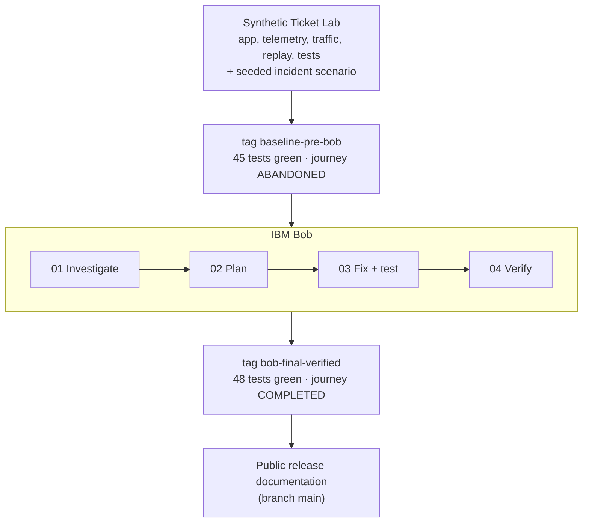
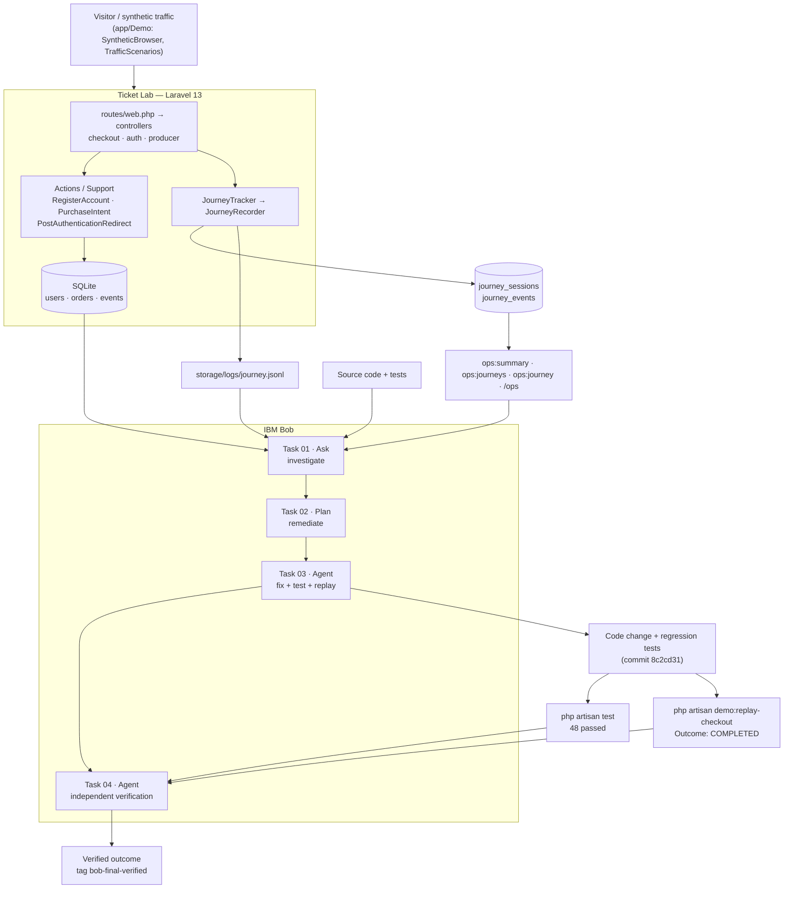

# JourneyOps

**From broken user journeys to verified fixes with IBM Bob.**

> *"The test suite was green. The user journey wasn't."*

**▶ Live demo: [https://journeyops.tickiton.com.br](https://journeyops.tickiton.com.br)** · [Guided demo](https://journeyops.tickiton.com.br/demo) · synthetic data and simulated payments only

Most coding agents start when a developer already knows what needs to be fixed.
JourneyOps starts one step earlier: working out what actually happened to the user.

JourneyOps is a workflow prototype. It gives **IBM Bob** evidence of real user journeys (journey telemetry, application state and the source code) instead of a hand-written bug ticket. Bob then investigates, finds the root cause, plans and implements a fix, adds regression tests, replays the original journey and independently verifies the result.

The prototype runs against a **synthetic ticketing application** (the *Ticket Lab*). The ticketing app is only the test bed: a controlled scenario prepared before IBM Bob started (see [Experiment baseline](#experiment-baseline)). The product idea is the workflow that connects:

```
user-journey telemetry + application state + source code + IBM Bob + verification
```

| | Before IBM Bob (`baseline-pre-bob`) | After IBM Bob (`bob-final-verified`) |
|---|---|---|
| Test suite | ✅ 45 passed | ✅ 48 passed / 191 assertions |
| Visitor who signs up at checkout | ❌ becomes a **producer** and never pays | ✅ becomes a **buyer** and pays |
| Replayed journey outcome | **ABANDONED** | **COMPLETED** |

---

## The problem

Engineering workflows usually start *after* someone already knows there is a bug: a failing test, a stack trace, a ticket that says what's broken. Many production failures don't look like that:

- a redirect that sends the user to the wrong place
- a role or account type assigned by an unexpected default
- behaviour that only breaks in a specific session state (for example, signing up *during* checkout)
- a funnel that silently loses users without raising an error
- flows that unit and feature tests never exercise end to end

In these cases nothing crashes and CI stays green. The hardest step is **reconstructing what actually happened to the user**. Only after that can anyone write the ticket.

## The idea

JourneyOps turns operational user-journey evidence into context for a coding agent:

```
production-like telemetry
  → anomaly investigation
  → source-code tracing
  → root cause
  → remediation plan
  → code fix
  → regression tests
  → journey replay
  → independent verification
```

Bob gets the recorded journeys (the event sequences, roles, redirect targets and outcomes of real visits) and is asked whether the purchase experience is healthy. It is **not** told that a bug exists.

## Experiment baseline

JourneyOps uses a synthetic ticketing application as a controlled software-engineering laboratory. **The lab and its incident scenario were prepared before the IBM Bob investigation began.** They include the purchase flow, authentication, buyer and producer roles, producer onboarding, journey telemetry, synthetic traffic, replay tooling and tests. The tag `baseline-pre-bob` marks that exact pre-Bob state.

Starting from that baseline, IBM Bob performed the engineering work in four separate tasks:

1. operational investigation;
2. remediation planning;
3. implementation and regression testing;
4. independent final verification.

The resulting verified state is preserved as `bob-final-verified`. Public-release documentation and packaging (this README, `docs/`, `LICENSE`) were added after that.



In short, the lab created the controlled problem space and IBM Bob did the investigation and remediation. Git history is left intact, so the provenance of every commit can be inspected.

## Why IBM Bob

Bob was used for the whole investigate → plan → fix → verify loop, not for autocomplete. Everything below is taken from the exported task histories in [`bob_sessions/`](bob_sessions/):

| Capability | Where it shows up |
|---|---|
| **Investigative reasoning from evidence** | Task 01 got a generic "is purchasing healthy?" prompt with instructions *not* to assume a bug. Bob summarised 16 journeys, separated normal from suspicious behaviour and isolated one journey (`JRN-721B2F18`) where a checkout signup produced a producer account. |
| **Parallel subagents** | Tasks 01 and 02 used `spawn_subagent` to read telemetry (`storage/logs/journey.jsonl`), configuration and source in parallel. |
| **Workspace reading and code tracing** | Bob traced the journey back through `register.blade.php` → `RegisterAccount` → `config/accounts.php` → `PostAuthenticationRedirect`, with file and line references. |
| **Plan mode and skills** | Task 02 ran in Plan mode with the `create-plan` skill. It compared four remediation options, chose one, and defined a regression plan and acceptance criteria. |
| **Challenging its own plan** | In Task 03 Bob re-checked the plan and found that a config-only fix could still break when `ACCOUNT_DEFAULT_TYPE=producer` is set. It switched to a config-independent, two-layer fix. |
| **Agent mode: edits, tests, commands** | Task 03 used `apply_diff`, ran the targeted and full PHPUnit suites, reset the lab and replayed the journey with `execute_command`. |
| **Independent verification** | Task 04 was a separate task that re-audited the corrected state without editing code: git state, source, tests, replay and telemetry. |
| **Evidence trail** | Every task was exported as Markdown and captured in a session screenshot showing mode, context size and Bobcoin usage. |

## Demo scenario

An organizer shares a link to *AI Builders Night 2026*. A new visitor opens it, clicks **Buy ticket**, hits the sign-in wall at checkout and chooses **Create an account**.

**Before**, at `baseline-pre-bob`:

```
event share visitor → checkout → sign-in wall → sign up
  → account created as PRODUCER → /producer/onboarding → purchase abandoned
```

**After**, at `bob-final-verified`:

```
event share visitor → checkout → sign-in wall → sign up
  → account created as BUYER → checkout resumed → order paid
```

The root cause was a combination of three things. The signup form hides the account-type selector when a purchase is in progress. The missing value then fell back to a config default of `producer`. Finally, new producers are sent to onboarding before the saved checkout URL is honoured. The existing tests covered each piece separately but never the combined path: *guest → checkout → sign up → back to checkout*.

## Before vs after

Measured with `php artisan demo:reset --force && php artisan demo:replay-checkout` at each tag:

| | Before (`baseline-pre-bob`) | After (`bob-final-verified`) |
|---|---|---|
| `signup_completed.user_role` | `producer` | `buyer` |
| `signup_completed.target_route` | `/producer/onboarding` | `/checkout/ai-builders-night-2026` |
| Next journey event | `producer_onboarding_viewed` | `checkout_resumed` |
| Journey outcome | **ABANDONED** | **COMPLETED** |
| Order | none | created and paid |
| Payment | none | `payment_started` → `payment_completed` |
| `demo:replay-checkout` exit code | `1` | `0` |
| Tests | 45 passed (165 assertions) | 48 passed (191 assertions), 0 regressions |
| Explicit producer signup (`account_type=producer`) | producer → onboarding | producer → onboarding (unchanged) |

## Architecture



More detail: [docs/ARCHITECTURE.md](docs/ARCHITECTURE.md).

## Bob workflow

Each task ran as a separate IBM Bob task. The later tasks received only the exported record of the earlier ones.

| Task | Mode | What Bob did | Evidence |
|---|---|---|---|
| **01 — Investigation** | Ask | Read telemetry, logs, docs and code without editing anything. Found that the one checkout-signup journey created a producer and ended abandoned on `/producer/onboarding`. Recommended a root-cause investigation. | [export](bob_sessions/journeyops_task01_operational_analysis.md) · [screenshot](bob_sessions/journeyops_task01_operational_analysis_summary.png) |
| **02 — Remediation planning** | Plan | Confirmed the root cause, compared four options (config default, controller guard, both, redirect reordering), defined regression tests, acceptance criteria and risks. | [export](bob_sessions/journeyops_task02_remediation_plan.md) · [screenshot](bob_sessions/journeyops_task02_remediation_plan_summary.png) |
| **03 — Implementation** | Agent | Re-validated the plan, implemented a two-layer fix, added 3 regression tests, ran the suite (48/48), reset the lab and replayed the journey (COMPLETED). | [export](bob_sessions/journeyops_task03_implementation.md) · [screenshot](bob_sessions/journeyops_task03_implementation_summary.png) |
| **04 — Independent verification** | Agent | Re-audited git state, source, tests, replay (over HTTP against `php artisan serve`) and telemetry without modifying source. Result: **VERIFIED**. | [export](bob_sessions/journeyops_task04_final_verification.md) · [screenshot](bob_sessions/journeyops_task04_final_verification_summary.png) |

**The fix** ([`8c2cd31`](https://github.com/filpe19/journeyops/commit/8c2cd31)):

1. **Invariant layer:** `RegisterController::store` forces `account_type = buyer` whenever a `PurchaseIntent` is active in the session, whatever `ACCOUNT_DEFAULT_TYPE` says.
2. **Default layer:** `config/accounts.php` now falls back to `buyer` instead of `producer`, and `.env.example` sets `ACCOUNT_DEFAULT_TYPE=buyer` explicitly.
3. **Regression tests:**
   - `test_guest_who_registers_during_checkout_returns_to_checkout_as_buyer`
   - `test_checkout_registration_forces_buyer_even_when_default_is_producer`
   - `test_registration_without_account_type_defaults_to_buyer`

Explicit producer registration (`/sell` → `account_type=producer` → onboarding) is unchanged.

## Evidence

[`bob_sessions/`](bob_sessions/) holds the unedited hackathon evidence:

- `journeyops_task0N_*.md`: human-readable exports of each IBM Bob task (prompt, tool calls and final report)
- `journeyops_task0N_*_summary.png`: task-session screenshots (mode, context length, Bobcoin usage)

These files are committed exactly as exported and have not been modified since.

## Technical stack

| Layer | Choice |
|---|---|
| Language / framework | PHP 8.4+ (developed on PHP 8.5), Laravel 13 |
| Database | SQLite |
| Frontend | Blade, Tailwind CSS 4, Vite 8 |
| Tests | PHPUnit 12 |
| Telemetry | Custom journey recorder → SQLite tables + JSON Lines log |
| AI engineering agent (investigation → verification) | IBM Bob (Ask, Plan and Agent modes, subagents, skills) |
| External services | None: no payment provider, no third-party APIs, no Docker |

## Run locally

Requirements: PHP 8.4+ with `pdo_sqlite`, Composer 2, Node.js 20+.

```bash
git clone https://github.com/filpe19/journeyops.git
cd journeyops
./scripts/setup.sh                      # composer install, .env, key, SQLite, migrate + seed, npm install + build
php artisan serve --host=127.0.0.1 --port=8000
```

Manual steps equivalent to `setup.sh`:

```bash
composer install
cp .env.example .env
php artisan key:generate
touch database/database.sqlite
php artisan migrate:fresh --seed
npm install
npm run build
```

Then open http://127.0.0.1:8000 and click **Launch live demo**.

| Route | What it is |
|---|---|
| `/` | JourneyOps overview: problem, before → after, IBM Bob workflow, architecture, evidence, Ticket Lab catalog |
| `/demo` | 5-step guided demo for judges |
| `/events/ai-builders-night-2026?ref=share` | The live, fixed ticket journey (same entry point as the original incident) |
| `/orders/{id}` | Purchase confirmation with the journey your visit recorded |
| `/ops` | Ops console with journey timelines (sign in as `admin@example.test` / `password`) |
| `/health` | Health check |

## Demo commands

```bash
php artisan demo:reset --force                   # wipe DB + journey log, reseed ~3 days of synthetic traffic
php artisan demo:replay-checkout                 # replay: share link → checkout → sign up → pay (exit 0 = COMPLETED)
php artisan ops:summary --days=7                 # sales and journey health
php artisan ops:journeys --with-sequence         # recent journeys with their event sequences
php artisan ops:journey JRN-XXXXXXXX             # full timeline of one journey (--json available)
```

Step-by-step walkthrough, including how to reproduce the **baseline** failure safely: [docs/DEMO_GUIDE.md](docs/DEMO_GUIDE.md).

The public instance at https://journeyops.tickiton.com.br runs the same `main` in an isolated container on a VPS. It blocks the ops console publicly and resets its synthetic data daily. See [docs/DEPLOYMENT.md](docs/DEPLOYMENT.md).

## Tests

```bash
php artisan test
```

At `bob-final-verified`: **48 passed, 191 assertions**. At `baseline-pre-bob`: 45 passed, 165 assertions. The baseline suite was green while the journey was broken.

`main` also adds `DemoExperienceTest` (3 tests) for the public demo pages, giving 51 passed / 206 assertions. The 48 Bob-verified tests are unchanged.

## Repository milestones

| Ref | Meaning |
|---|---|
| commits `7006c0b` … `5f69cc3` | Construction of the Ticket Lab and its incident scenario, before any IBM Bob task. |
| tag `baseline-pre-bob` (`5f69cc3`) | The lab before IBM Bob touched it. The defect is present and all tests pass. |
| commits `e0ef7e2` … `9cb0a14` | IBM Bob's work committed to the repository: Task 01 and 02 evidence, Bob's fix and tests (`8c2cd31`), then Task 03 and 04 evidence. |
| tag `bob-final-verified` (`9cb0a14`) | The state IBM Bob independently verified in Task 04. |
| branch `bob-investigation` | The branch the Bob work happened on (points at `bob-final-verified`). |
| branch `main` | `bob-final-verified` plus the public documentation in this release. |

Because both ends are tagged, the before/after comparison can be reproduced exactly: `git diff baseline-pre-bob bob-final-verified -- app config tests .env.example`.

## Data and privacy

- **Synthetic data only.** Every account uses the reserved `example.test` domain. Names, organizers and events are invented.
- **No real users and no customer data.** No production databases, dumps or analytics exports were used.
- **Simulated payment.** `SimulatedPaymentGateway` always approves locally. No card data is requested or stored.
- Telemetry never records passwords, tokens, cookies, session IDs or IP addresses. See [docs/DATA_POLICY.md](docs/DATA_POLICY.md).

## Documentation

| Document | Purpose |
|---|---|
| [docs/ARCHITECTURE.md](docs/ARCHITECTURE.md) | JourneyOps architecture, agent workflow and trust model |
| [docs/DEMO_GUIDE.md](docs/DEMO_GUIDE.md) | Reproduce the demo (before and after) locally |
| [docs/DEPLOYMENT.md](docs/DEPLOYMENT.md) | How the public demo is deployed, hardened and reset |
| [docs/TICKET_LAB_ARCHITECTURE.md](docs/TICKET_LAB_ARCHITECTURE.md) | Ticket Lab internals: routes, flows, data model |
| [docs/OBSERVABILITY.md](docs/OBSERVABILITY.md) | Journey event catalogue, outcome rules, JSONL and SQL |
| [docs/LOCAL_DEVELOPMENT.md](docs/LOCAL_DEVELOPMENT.md) | Local setup and troubleshooting |
| [docs/DATA_POLICY.md](docs/DATA_POLICY.md) | Synthetic data policy |
| [AGENTS.md](AGENTS.md) | Orientation for engineers and coding agents (the context Bob worked from) |
| [docs/README.md](docs/README.md) | Index, including hackathon submission materials |

## Hackathon

JourneyOps was built for the **IBM Bob 2.0 Hackathon**. It is a prototype of a workflow, not a production SaaS. The Ticket Lab, its traffic and its seeded defect were prepared before the Bob tasks as a controlled, reproducible laboratory for showing that workflow end to end. The hackathon work shown here is what IBM Bob did from `baseline-pre-bob` onward.

## License

This project is licensed under the [MIT License](LICENSE).
