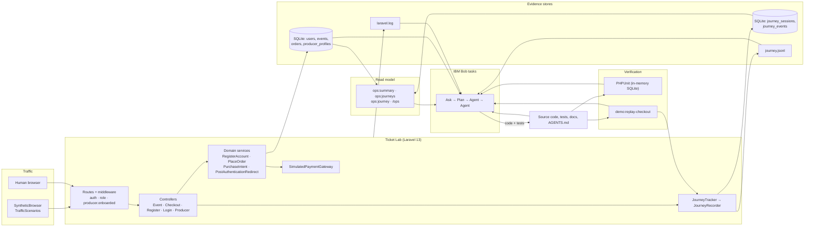
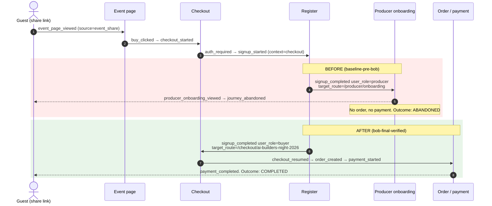
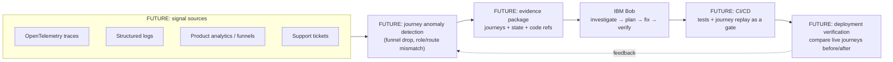

# JourneyOps — Architecture

This document describes the JourneyOps workflow: how user-journey evidence, application state, source code and IBM Bob fit together, and how each result is verified. Ticket Lab internals (routes, controllers, data model) are documented separately in [TICKET_LAB_ARCHITECTURE.md](TICKET_LAB_ARCHITECTURE.md).

> **Core principle.** JourneyOps does not give the coding agent a bug ticket.
> It gives the agent evidence of what actually happened in the user journey, and asks it to decide whether anything is wrong.

---

## 1. Problem framing

A coding agent is normally invoked with a problem statement a human already wrote: "fix X", "this test fails", "users report Y". That assumes the hardest part is done. In practice many production defects:

- raise no exception and fail no test;
- only appear in one specific combination of session state (here: *a guest who signs up while a purchase is in progress*);
- show up only as a behavioural signal: a user who ends up on the wrong page, gets the wrong role and leaves.

The Ticket Lab's baseline suite passes **45/45 tests** while every new visitor who signs up at checkout is turned into an event organizer and loses their purchase. The unit of truth that exposes this is the **user journey**, not the test suite.

## 2. System boundaries

| Inside the prototype | Outside the prototype (future work) |
|---|---|
| A Laravel 13 Ticket Lab with a real purchase and signup funnel | Real production systems and real users |
| A journey recorder writing to SQLite and JSON Lines | OpenTelemetry, APM traces, analytics platforms |
| Synthetic traffic that drives the real HTTP flows | Live traffic, support tickets, session replay tools |
| `ops:*` Artisan commands and an `/ops` view as the read model | Alerting, anomaly-detection services |
| IBM Bob run as four separate, human-initiated tasks | Automatic triggering of Bob from alerts or CI |
| Regression tests + deterministic journey replay as verification | Deployment gates, canary analysis, post-deploy monitoring |

A human starts each Bob task with a prompt and reviews the output. JourneyOps is **not** an autonomous production system. It is a demonstration of the evidence loop an agent needs.

## 3. Role of the Ticket Lab

The Ticket Lab is a controlled environment for running the workflow end to end:

- **Realistic enough:** organizers (producers) publish events and share links; buyers check out, sign in or sign up at a sign-in wall, and pay. Roles, onboarding middleware, session-based purchase intent and post-login redirects are all real Laravel code.
- **Deterministic:** `demo:reset --force` rebuilds the database and replays ~3 days of synthetic visits through the actual routes, middleware, sessions and CSRF (`app/Demo/SyntheticBrowser`). The same journeys come out every time.
- **Safe to publish:** all data is synthetic (`@example.test`) and payments are simulated.

The lab contains one realistic defect, in the interaction between three individually reasonable pieces of code:

| Piece | Behaviour at `baseline-pre-bob` |
|---|---|
| `resources/views/auth/register.blade.php` | Hides the buyer/producer selector when a `PurchaseIntent` is active (sensible UX). |
| `app/Actions/Accounts/RegisterAccount.php` | Missing `account_type` falls back to `config('accounts.default_type')`. |
| `config/accounts.php` | Default was `env('ACCOUNT_DEFAULT_TYPE', 'producer')`. |
| `app/Support/PostAuthenticationRedirect.php` | New producers go to onboarding *before* `redirect()->intended()` (correct for real producers). |

## 4. Journey telemetry model

Every user-visible step of the purchase and signup funnels emits a journey event through `App\Journey\JourneyTracker`, which `JourneyRecorder` writes to two places:

- `journey_sessions` / `journey_events` (SQLite): one session per logical visit (source, entry route, user, timestamps), events with JSON metadata.
- `storage/logs/journey.jsonl`: one JSON object per event, for `grep`/`jq`.

Each event carries `journey_code`, `source` (`event_share`, `homepage`, `email`, …), `user_role` at that moment, `route`, `previous_route` and step-specific metadata such as `target_route` (where the response redirected) and `expected_destination` (where the user should return). An `X-Journey-Id` response header ties any HTTP response to its journey.

Outcomes are **derived**, not stored: `completed` (has `payment_completed`), `abandoned` (entered the funnel, ended, no payment), `no_checkout`, `active`. Full catalogue: [OBSERVABILITY.md](OBSERVABILITY.md).

Recording `user_role` and `target_route` on every event is what made this defect visible. `signup_completed` with `user_role=producer` and `target_route=/producer/onboarding`, directly after `signup_started` with `context=checkout`, only makes sense as an anomaly.

### A. System architecture



## 5. IBM Bob interaction model

Bob works directly in the repository workspace. Its evidence sources are the files and tools a production engineer would use:

| Evidence | How Bob accessed it (per task exports) |
|---|---|
| Journey telemetry | Read `storage/logs/journey.jsonl` via subagents (Task 01); `grep` + `python3` over the JSONL (Task 04); `php artisan ops:journey --json` (Task 03) |
| Application state | Journey outcomes, roles and orders from telemetry; the replay command's final state report (role, producer profile, orders) |
| Source code | `read_file`, `list_files`, `grep` across controllers, actions, config, views, tests |
| Project context | `AGENTS.md`, `docs/OBSERVABILITY.md`, `.env.example` |
| Execution | `execute_command` for `php artisan test`, `demo:reset`, `demo:replay-checkout`, `git status/show/diff` |

Each task was a **separate Bob task** with its own prompt. Continuity between tasks came only from the exported Markdown record of the previous tasks (`bob_sessions/`), so each step had to be justified by evidence the next task could re-check.

### C. Agent workflow

```mermaid
flowchart LR
    O["Observe<br/>telemetry, ops data"] --> I["Investigate<br/>normal vs suspicious"]
    I --> Co["Correlate<br/>journey ↔ code path"]
    Co --> P["Plan<br/>options, trade-offs,<br/>acceptance criteria"]
    P --> F["Fix<br/>minimal change set"]
    F --> T["Test<br/>regression + full suite"]
    T --> R["Replay<br/>original journey"]
    R --> V["Verify<br/>independent re-audit"]

    classDef t1 fill:#e8f0fe,stroke:#4a6fa5,color:#1a1a1a
    classDef t2 fill:#fff4e5,stroke:#b7791f,color:#1a1a1a
    classDef t3 fill:#e6f4ea,stroke:#2f855a,color:#1a1a1a
    classDef t4 fill:#f3e8fd,stroke:#6b46c1,color:#1a1a1a
    class O,I,Co t1
    class P t2
    class F,T,R t3
    class V t4
```



Colours map to tasks: blue = Task 01 (Ask), orange = Task 02 (Plan), green = Task 03 (Agent), purple = Task 04 (Agent).

## 6. Investigation workflow (Task 01, Ask mode)

The prompt asked whether the purchase experience was "operating normally" and explicitly said *not* to assume a bug, *not* to jump to code first, and *not* to treat every abandonment as a defect.

What Bob did ([export](../bob_sessions/journeyops_task01_operational_analysis.md)):

1. Spawned subagents to read the journey log, then the relevant source and configuration.
2. Summarised the window: 16 journeys and 7 paid orders.
3. Classified journeys. Login-based recoveries at the sign-in wall and a guest who gave up at sign-in were marked **normal**.
4. Flagged `JRN-721B2F18` as **suspicious**: `signup_started (context=checkout)` → `signup_completed (user_role=producer, target_route=/producer/onboarding)` → `producer_onboarding_viewed` → `journey_abandoned`.
5. Only then traced the code path (`@unless ($purchase)` in the register view → `?? config('accounts.default_type')` → `'producer'` fallback → onboarding redirect before `intended()`).
6. Concluded that a deeper root-cause investigation was warranted and listed what to confirm next.

### B. Journey timeline — the anomalous journey vs. the corrected one



## 7. Remediation workflow (Tasks 02 and 03)

**Task 02, Plan mode, `create-plan` skill** ([export](../bob_sessions/journeyops_task02_remediation_plan.md)). Bob confirmed the causal chain and compared four options:

| Option | Assessment in Task 02 |
|---|---|
| A. Change the config default to `buyer` | Recommended as the minimal fix |
| B. Force buyer in `RegisterController` when a `PurchaseIntent` is active | Deterministic, but more controller logic |
| C. Both A and B | Belt and braces, judged over-engineered at that point |
| D. Let `intended()` take precedence over producer onboarding | Rejected: would weaken the producer onboarding gate |

It also defined the regression tests, the acceptance criteria and a post-fix replay plan.

**Task 03, Agent mode** ([export](../bob_sessions/journeyops_task03_implementation.md)). The prompt required re-validating the plan before editing. Bob found that **option A alone still fails** if a deployment sets `ACCOUNT_DEFAULT_TYPE=producer`. The business invariant ("a guest registering during a purchase must become a buyer and return to checkout") should not depend on deployment config, so Bob implemented **option C**:

```php
// app/Http/Controllers/Auth/RegisterController.php — invariant layer
if (PurchaseIntent::event($request->session()) !== null) {
    $validated['account_type'] = UserRole::Buyer->value;
}
```

```php
// config/accounts.php — default layer
'default_type' => env('ACCOUNT_DEFAULT_TYPE', 'buyer'),
```

The change set was 5 files: the two above, `.env.example`, and two test files. Bob did not change `RegisterAccount`, `PostAuthenticationRedirect`, `PurchaseIntent`, the register view, models, migrations or routes. The change was committed as `8c2cd31`.

Regression tests added:

| Test | Proves |
|---|---|
| `CheckoutTest::test_guest_who_registers_during_checkout_returns_to_checkout_as_buyer` | The exact escaped journey: buyer role, redirect to checkout, paid order, `checkout_resumed` present, `producer_onboarding_viewed` absent, `signup_completed.user_role = buyer` |
| `CheckoutTest::test_checkout_registration_forces_buyer_even_when_default_is_producer` | The invariant holds with `accounts.default_type = producer` |
| `RegistrationTest::test_registration_without_account_type_defaults_to_buyer` | The general default is now `buyer` |

The existing `test_producer_registration_leads_to_onboarding` covers explicit producer signup and was left unchanged.

## 8. Verification workflow

Verification has three independent legs, and they must agree:

1. **Tests.** `php artisan test` gives 48 passed, 191 assertions (baseline: 45 passed, 165 assertions).
2. **Replay.** `php artisan demo:replay-checkout` drives a brand-new visitor through the same shared-link → checkout → signup path via the real HTTP stack. It prints each expected stage as OBSERVED/MISSING, the browser path, the final account role and the outcome, and exits `0` only when the journey completes with a payment.
3. **Telemetry.** The replayed journey's events are read back from `journey.jsonl` / `ops:journey` and checked field by field.

**Task 04, Agent mode, independent audit** ([export](../bob_sessions/journeyops_task04_final_verification.md)). A separate task was told not to trust Task 03 and not to edit code. It:

- checked git state before and after (clean, no source modified);
- re-read the fix commit with `git show 8c2cd31`;
- ran `CheckoutTest` (10), `RegistrationTest` (10), `ProducerAreaTest` (6) and the full suite (48/48, 191 assertions);
- reset the lab and replayed the journey **over HTTP** against `php artisan serve`, getting `JRN-9091D539` and **COMPLETED**;
- confirmed from the JSONL that `producer_onboarding_viewed` was absent in the replayed journey, and that the seeded producer journey (`JRN-1FB32E21`) still went producer → onboarding → completed;
- reported **VERIFIED**, with no inconsistencies between implementation, tests, telemetry and Task 03's claims.

## 9. Trust and evidence model

| Claim | Evidence that backs it | How to re-check |
|---|---|---|
| The defect existed while tests were green | Tag `baseline-pre-bob`: 45/45 pass, replay ABANDONED with exit 1 | [DEMO_GUIDE.md § Baseline](DEMO_GUIDE.md#4-reproduce-the-baseline-failure-optional) |
| Bob found it without being told | Task 01 prompt and report | `bob_sessions/journeyops_task01_operational_analysis.md` |
| The fix is minimal and targeted | Commit `8c2cd31` | `git show 8c2cd31` |
| The fix works | 48/48 tests, replay COMPLETED with exit 0 | `php artisan test`, `php artisan demo:replay-checkout` |
| Producers are unaffected | `test_producer_registration_leads_to_onboarding`, `ProducerAreaTest`, seeded producer journey | `php artisan ops:journeys --source=producer_landing --with-sequence` |
| Verification did not alter the code | Task 04 git status before and after | `bob_sessions/journeyops_task04_final_verification.md` |
| What Bob actually did | Unedited task exports and session screenshots | `bob_sessions/` |

Design choices that keep this trustworthy:

- **Tags on both ends.** `baseline-pre-bob` and `bob-final-verified` make the comparison reproducible by anyone.
- **Separate tasks.** The verifier ran as its own task, with its own prompt and a no-edit constraint.
- **Deterministic replay.** The same scenario, the same seed data and a binary exit code.
- **Evidence committed next to the code.** Bob's reasoning lives in the repository history, not only in a chat window.

## 10. Before/after state

| | `baseline-pre-bob` | `bob-final-verified` |
|---|---|---|
| `signup_completed.user_role` | `producer` | `buyer` |
| `signup_completed.target_route` | `/producer/onboarding` | `/checkout/ai-builders-night-2026` |
| Next event | `producer_onboarding_viewed` | `checkout_resumed` |
| Outcome | ABANDONED | COMPLETED |
| Order / payment | none / none | created / `payment_completed` |
| Tests | 45 passed (165 assertions) | 48 passed (191 assertions) |
| `ACCOUNT_DEFAULT_TYPE=producer` breaks checkout signup | yes | no (invariant layer) |
| Explicit producer signup | producer → onboarding | producer → onboarding |

## 11. Current limitations

- **Synthetic environment.** One lab application, one seeded defect, synthetic traffic. The workflow has not been run against real production telemetry.
- **Human-initiated.** Each Bob task was started manually with a written prompt. Nothing triggers Bob automatically.
- **Custom telemetry.** The journey recorder is purpose-built. It is not OpenTelemetry and has no sampling, retention or PII pipeline beyond a redaction list.
- **File-based handoff.** Context moved between tasks through exported Markdown files, not a structured API.
- **No deployment step.** Verification ends at tests plus local replay. There is no CI, canary or post-deploy monitoring.
- **Single-app scope.** No cross-service tracing.

## 12. Future architecture

Everything in this section is **FUTURE** and **not implemented**.



- Map journey events onto OpenTelemetry spans and attributes so existing tracing can feed the same workflow.
- Automatically package anomalous journeys, the related records and code references as a Bob task input.
- Turn replay scenarios into CI checks, so a journey regression blocks a merge the way a failing test does.
- After deployment, compare journey outcomes before and after the change to confirm the fix in production.
